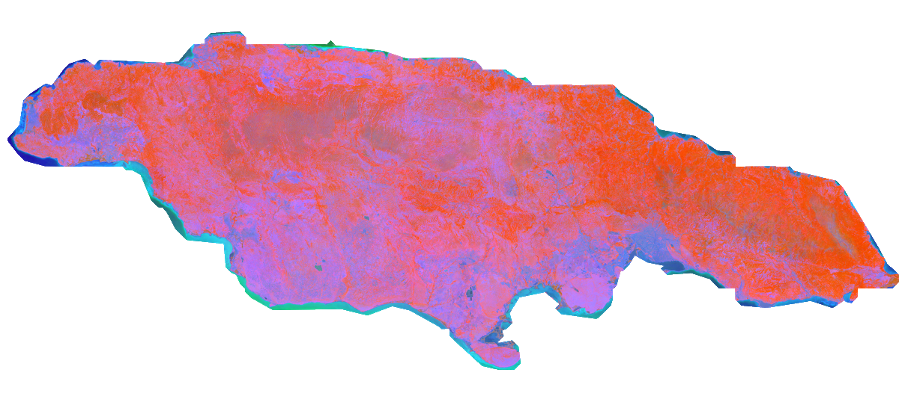
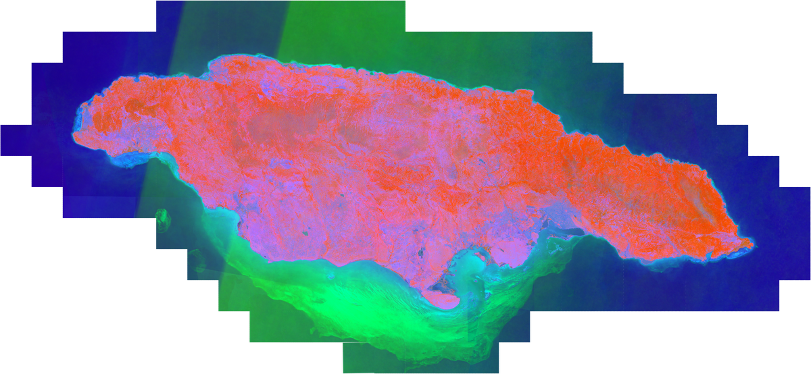

# TESSERA Coastal Gap-Fill

Extend TESSERA embedding coverage beyond the terrestrial boundary so that coastal and nearshore areas are fully represented.

## Motivation

[GeoTessera](https://pypi.org/project/geotessera/) provides precomputed TESSERA embeddings on a global 0.1-degree grid, but coverage was generated using a relatively coarse land mask. This causes two problems for coastal work:

1. **Ocean and nearshore areas are blanked out.** Any part of a tile that falls outside the land mask contains no embedding data. Reefs, seagrass beds, and shallow shelf areas are missing.
2. **Coastal land is often clipped.** Because the mask is coarse, it frequently cuts into the shoreline itself, removing mangroves, intertidal zones, salt marshes, coastal wetlands, and other ecosystems that sit right at the land--sea boundary.

If your area of interest includes any of these environments, the precomputed tiles may have incomplete or missing coverage -- making it difficult to use TESSERA embeddings for work that spans the coast.

This module solves that problem. Point it at an AOI GeoJSON, and it will identify which tiles have incomplete coverage, regenerate them from Sentinel-1/2 imagery, and export a seamless set of GeoTIFFs that extend well beyond the shoreline.

**Jamaica -- before and after coastal gap-fill** (PCA false-colour preview):

| GeoTessera only | With coastal gap-fill |
|:---:|:---:|
|  |  |

Notice how the precomputed coverage clips tightly to the land mass, missing the south coast shelf, mangrove-fringed bays, and offshore cays. After gap-fill, coverage extends seamlessly into nearshore waters.

## Prerequisites

- TESSERA repository cloned (this module lives alongside `tessera_preprocessing`, `tessera_infer`, and `tessera_infer_QAT`)
- Conda environment with TESSERA dependencies plus those in `requirements.txt`
- Access to the GeoTessera Python package (`pip install geotessera`)
- GPU for QAT inference (tested with NVIDIA RTX 4000 Ada, 20 GB VRAM)

## Workflow

```
AOI GeoJSON
     │
     ▼
┌────────────────────────────┐
│  identify_coastal_tiles.py │  Queries GeoTessera registry, downloads
│                            │  precomputed tiles, scans for blank ocean
│                            │  pixels, groups tiles needing regeneration,
│                            │  writes ROI TIFFs + manifest.json
└────────────┬───────────────┘
             │
             ▼
┌────────────────────────────┐
│  run_coastal_pipeline.sh   │  For each group in the manifest:
│                            │  download S1/S2 → stack → patchify →
│                            │  QAT inference → stitch
└────────────┬───────────────┘
             │
             ▼
┌────────────────────────────┐
│  export_tiles.py           │  Combines GeoTessera + gap-fill into
│                            │  sliver-free 0.1° GeoTIFF tiles
└────────────┬───────────────┘
             │
             ▼
┌────────────────────────────┐
│  create_preview.py         │  PCA false-colour 3-band RGBA previews
│                            │  for visual inspection in GIS software
└────────────────────────────┘
```

## Usage

### Step 1: Identify tiles and create ROIs

```bash
python tessera_coastal/identify_coastal_tiles.py \
    --aoi boundaries/my_aoi.geojson \
    --geotessera-dir data/geotessera \
    --output-dir data/coastal_groups \
    --year 2024 \
    --download
```

The `--download` flag fetches available GeoTessera tiles before scanning.  If you already have tiles on disk, omit it.

Key options:

| Flag | Default | Description |
|------|---------|-------------|
| `--zero-threshold` | `0.001` | Fraction of blank pixels to trigger regeneration |
| `--max-group-extent` | `0.2` | Max spatial extent of a processing group (degrees) |
| `--group-prefix` | `group` | Prefix for group directory names |

### Step 2: Run the inference pipeline

```bash
bash tessera_coastal/run_coastal_pipeline.sh \
    --project-dir /path/to/project \
    --tessera-root /path/to/tessera \
    --python-env /path/to/conda/envs/tessera_env/bin/python \
    --manifest data/coastal_groups/manifest.json
```

To process a single group:

```bash
bash tessera_coastal/run_coastal_pipeline.sh \
    --project-dir ... --tessera-root ... --python-env ... \
    --group group_003
```

If some groups fail (e.g. due to memory), retry just the failed ones with conservative memory settings:

```bash
bash tessera_coastal/run_coastal_pipeline.sh \
    --project-dir ... --tessera-root ... --python-env ... \
    --retry-failed
```

Key options:

| Flag | Default | Description |
|------|---------|-------------|
| `--low-mem` | off | Use conservative memory settings for all groups |
| `--gpu-batch-size` | `512` | Batch size for GPU inference |
| `--patch-size` | `500` | Tile size for patchification |
| `--year` | `2024` | Sentinel data year |

Memory tuning can also be set via environment variables: `S1_PARTITIONS`, `S1_WORKERS`, `S2_PARTITIONS`, `S2_WORKERS`, etc.

### Step 3: Export tiles

```bash
python tessera_coastal/export_tiles.py \
    --geotessera-dir data/geotessera \
    --gaps-dir data/coastal_groups \
    --output-dir data/export
```

This produces:

- `data/export/npy/` -- NumPy tiles with metadata
- `data/export/geotiff/` -- Multi-band GeoTIFFs (ZSTD compressed, tiled layout)

GeoTessera tiles are copied first and take priority for any tile centres that appear in both sources, since their native extents overlap correctly.  Gap-fill tiles are extracted with a configurable pixel buffer (`--overlap-px`, default 20) to prevent slivers between adjacent tiles.

### Step 4: Create preview tiles

```bash
python tessera_coastal/create_preview.py \
    --input-dir data/export/geotiff \
    --output-dir data/export/preview
```

Produces 4-band RGBA GeoTIFFs (PCA false-colour) for quick visual inspection.

## Output structure

```
data/export/
  geotiff/
    grid_-77.05_18.15.tif    128-band float32 GeoTIFF
    grid_-77.05_18.25.tif
    ...
  preview/
    grid_-77.05_18.15.tif    3-band + alpha uint8 GeoTIFF
    grid_-77.05_18.25.tif
    ...
    pca_params.npz           PCA components for reproducibility
  npy/
    grid_-77.05_18.15/
      grid_-77.05_18.15.npy  Raw embedding array (H, W, 128)
      metadata.json          CRS, transform, provenance
    ...
```

## Known limitations

- **Terrestrial training bias.** TESSERA was trained primarily on terrestrial systems. The embeddings will extend into nearshore and open water, but may not capture subtle oceanic or submarine differences as effectively as they do on land. Fine-tuning on coastal training data would improve sensitivity for marine applications.
- Tiles may span multiple UTM zones. The module handles this automatically, but downstream applications that need a single CRS should reproject accordingly.
